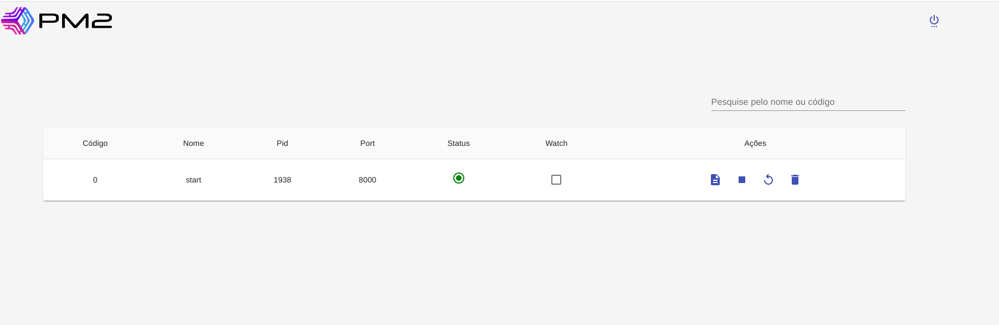

<div align="center">
  
  <h1 align="center">Pm2-monit</h1> 
</div>


## Project developed to control pm2 process, it was developed in node (backend) and react (frontend)


### Preview
---

<h1 align="center">

  

</h1>

### Clone

---

```sh
$ git clone https://github.com/AndreLuizPedroBotelho/pm2-monit.git
```

### Installation

---

```sh
$ cd pm2-monit

$ npm install
```

### Configure

---

Configure env file in backend and frontend folders using env.example as a base

### Usage

---

Starting projects

```sh
$ npm start
```

### Tech Stack
---

- react 
- node
- typescript
- adonis
- lerna


### Required

---

- node >= 12.19.0 
- pm2


### Keep in Touch
---

- [Github](https://github.com/AndreLuizPedroBotelho)
- [Linkedin](https://www.linkedin.com/in/andr%C3%A9-luiz-pedro-botelho/)


